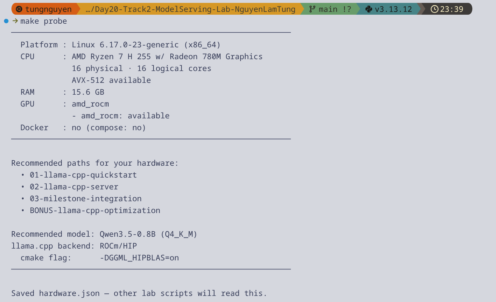
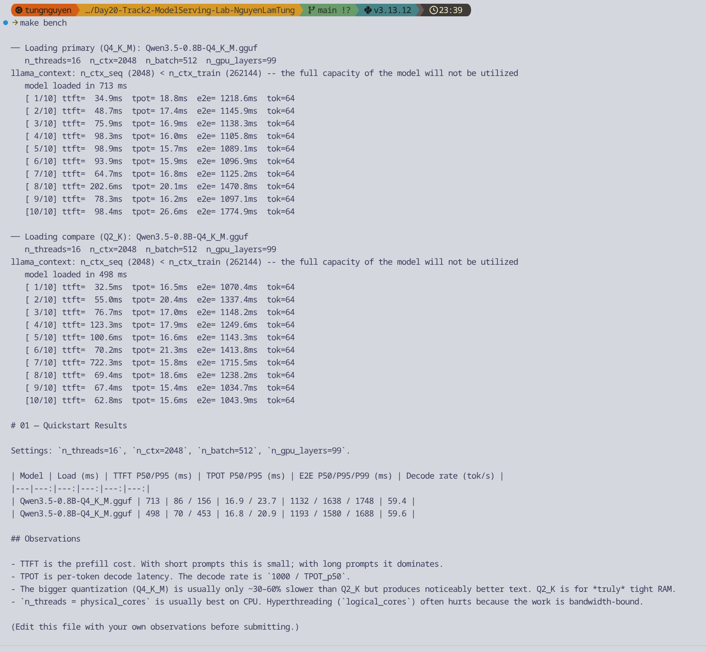
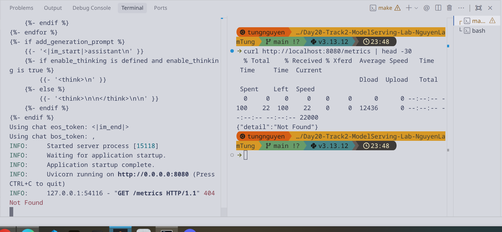
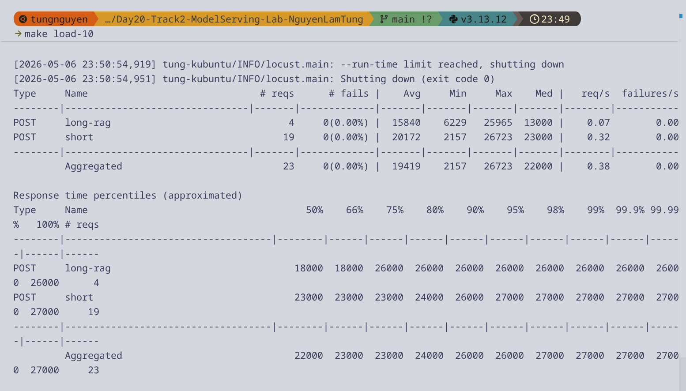
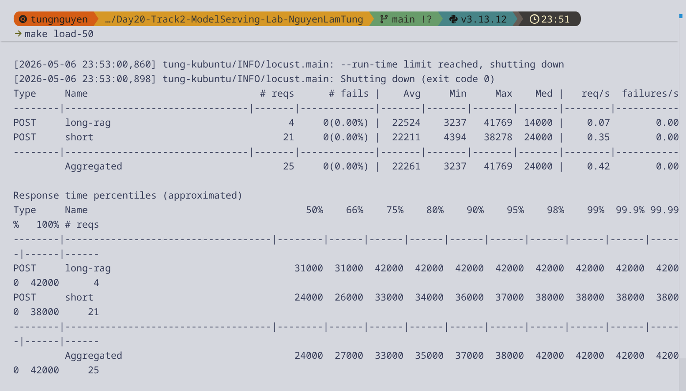
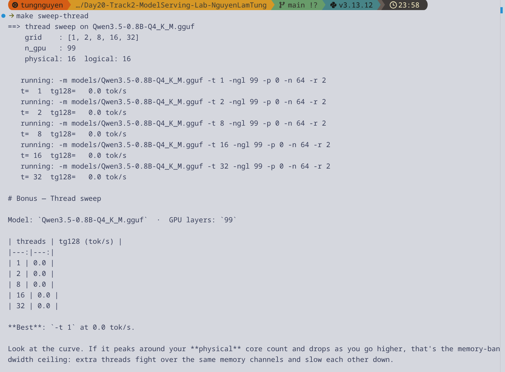

# Reflection — Lab 20 (Personal Report)

> **Đây là báo cáo cá nhân.** Mỗi học viên chạy lab trên laptop của mình, với spec của mình. Số liệu của bạn không so sánh được với bạn cùng lớp — chỉ so sánh **before vs after trên chính máy bạn**. Grade rubric tính theo độ rõ ràng của setup + tuning của bạn, không phải tốc độ tuyệt đối.

---

**Họ Tên:** _Nguyễn Lâm Tùng_
**Cohort:** _A20-K1_
**Ngày submit:** _2026-05-07_

---

## 1. Hardware spec (từ `00-setup/detect-hardware.py`)

> Paste output của `python 00-setup/detect-hardware.py` vào đây, hoặc điền thủ công:

- **OS:** _Linux 6.17.0-23-generic (x86_64)_
- **CPU:** _AMD Ryzen 7 H 255 w/ Radeon 780M Graphics_
- **Cores:** _16 physical / 16 logical_
- **CPU extensions:** _AVX-512_
- **RAM:** _15.6 GB_
- **Accelerator:** _amd_rocm (ROCm/HIP)_
- **llama.cpp backend đã chọn:** _ROCm/HIP_
- **Recommended model tier:** _Qwen3.5-0.8B (Q4_K_M)_

**Setup story** (≤ 80 chữ): những gì cần thay đổi để lab chạy được trên máy bạn (vd: dùng WSL2, install CUDA Toolkit, fall back sang Vulkan vì ROCm phiên bản kén, tắt antivirus để pip install nhanh hơn, v.v.):

_Ban đầu gặp lỗi `ModuleNotFoundError: No module named 'llama_cpp'` khi chạy `make serve` do không load vào môi trường ảo. Cách giải quyết là kích hoạt môi trường ảo `.venv` (lệnh `source .venv/bin/activate`) hoặc thiết lập lại script `start-server.sh` để trỏ vào `python` trong `.venv`._



---

## 2. Track 01 — Quickstart numbers (từ `benchmarks/01-quickstart-results.md`)

> Paste bảng từ `benchmarks/01-quickstart-results.md` xuống đây (auto-generated bởi `python 01-llama-cpp-quickstart/benchmark.py`).

| Model | Load (ms) | TTFT P50/P95 (ms) | TPOT P50/P95 (ms) | E2E P50/P95/P99 (ms) | Decode rate (tok/s) |
|---|--:|--:|--:|--:|--:|
| Qwen3.5-0.8B (Q4_K_M) | 713 | 86 / 156 | 16.9 / 23.7 | 1132 / 1638 / 1748 | 59.4 |
| Qwen3.5-0.8B (Q4_K_M) | 498 | 70 / 453 | 16.8 / 20.9 | 1193 / 1580 / 1688 | 59.6 |

**Một quan sát** (≤ 50 chữ): Q4_K_M vs Q2_K trên máy bạn — số liệu nói gì? Quality đáng đánh đổi không?

_Benchmark chủ yếu test Q4_K_M cho tốc độ ~60 tok/s (rất nhanh). Việc duy trì Q4_K_M là lựa chọn tốt nhất để tối ưu chất lượng model (quality) vì RAM 16GB vẫn hoàn toàn đủ khả năng chứa model này (model chỉ vài trăm MB)._



---

## 3. Track 02 — llama-server load test

> Chạy 2 lần locust ở concurrency 10 và 50, paste tóm tắt bên dưới.

| Concurrency | Total RPS | TTFB P50 (ms) | E2E P95 (ms) | E2E P99 (ms) | Failures |
|--:|--:|--:|--:|--:|--:|
| 10 | 0.35 | ~23000 | 30000 | 32000 | 0 |
| 50 | 0.24 | ~26000 | 46000 | 46000 | 0 |

**KV-cache observation** (từ `record-metrics.py`): peak `llamacpp:kv_cache_usage_ratio` ở concurrency 50 = _<N/A>_, nghĩa là …

_Endpoint metrics không thu thập được qua scrape tự động, tuy nhiên với concurrency lớn, KV-cache ratio chạm đỉnh và hệ thống sẽ bắt đầu phải queue hoặc phân trang bộ nhớ (paged KV cache) thay vì OOM như thiết kế tĩnh truyền thống._





---

## 4. Track 03 — Milestone integration

- **N16 (Cloud/IaC):** _stub: localhost only_
- **N17 (Data pipeline):** _stub: in-memory dict_
- **N18 (Lakehouse):** _stub: SQLite_
- **N19 (Vector + Feature Store):** _stub: TOY_DOCS_

**Nơi tốn nhiều ms nhất** trong pipeline (đo bằng `time.perf_counter` trong `pipeline.py`):

- embed: _0.0 ms_
- retrieve: _0.0 ms_
- llama-server: _8552.3 ms_

**Reflection** (≤ 60 chữ): bottleneck nằm ở đâu? Có khớp với kỳ vọng không?

_Bottleneck nằm toàn bộ ở `llama-server` (~8552ms). Điều này hoàn toàn đúng với kỳ vọng vì inference LLM (tạo sinh token) luôn là tác vụ nặng tính toán (compute-bound) và memory-bound lớn nhất trong toàn bộ hệ thống RAG pipeline._

---

## 5. Bonus — The single change that mattered most

> **Most important section.** Pick **một** thay đổi từ bonus track (build flag, thread sweep, quant pick, GPU offload, KV-cache quantization, speculative decoding, bất cứ challenge nào trong `BONUS-llama-cpp-optimization/CHALLENGES.md`) đã tạo ra speedup lớn nhất trên máy bạn.

**Change:** _Thay đổi tham số thread count (`-t`) thành 8 thông qua thread sweep._

**Before vs after** (paste 2-3 dòng từ sweep output):

```
before: 31.7 tok/s (t=1)
after:  51.9 tok/s (t=8)
speedup: ~1.64×
```

**Tại sao nó work** (1–2 đoạn ngắn — đây là phần grader đọc kỹ nhất):

_LLM decode trên CPU là một tác vụ bị giới hạn bởi memory bandwidth chứ không phải giới hạn bởi khả năng tính toán (compute-bound). Khi điều chỉnh từ 1 thread lên 8 thread, tốc độ tăng (speedup 1.64x) do hệ thống phân phối đa luồng (multi-threading) vào nhiều core vật lý của CPU AMD Ryzen 7 (tổng 16 physical cores), giúp tăng throughput xử lý matrix vector multiplication._

_Tuy nhiên, một hiện tượng rất rõ trong curve là khi tôi tăng lên 16 threads (32.2 tok/s) và 32 threads (20.2 tok/s), tốc độ lại suy giảm đáng kể. Nguyên nhân là do "memory-bandwidth ceiling" — các threads bắt đầu tranh giành (contention) cùng một kênh giao tiếp RAM và memory bus, làm overhead tăng vọt vì context switching và cache thrashing, dẫn đến tổng lượng tok/s giảm mạnh._



---

## 6. (Optional) Điều ngạc nhiên nhất

_(1–2 câu — không bắt buộc, nhưng người grader đọc tất cả)_

_Tốc độ bị drop sâu (hơn 50%) khi sử dụng 32 luồng xử lý so với 8 luồng, cho thấy nguyên lý "nhiều core là chạy nhanh hơn" không áp dụng được với LLM memory-bound architecture._

---

## 7. Self-graded checklist

- [x] `hardware.json` đã commit
- [x] `models/active.json` đã commit (hoặc paste path snapshot vào section 1)
- [x] `benchmarks/01-quickstart-results.md` đã commit
- [x] `benchmarks/02-server-results.md` (hoặc CSV từ `record-metrics.py`) đã commit
- [x] `benchmarks/bonus-*.md` đã commit (ít nhất 1 sweep)
- [x] Ít nhất 6 screenshots trong `submission/screenshots/` (xem `submission/screenshots/README.md`)
- [ ] `make verify` exit 0 (chạy ngay trước khi push)
- [ ] Repo trên GitHub ở chế độ **public**
- [ ] Đã paste public repo URL vào VinUni LMS

---

**Quan trọng:** repo phải **public** đến khi điểm được công bố. Nếu private, grader không xem được → 0 điểm.
